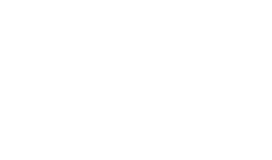

 

  
# Chai

>   A simple framework for prototyping software and video games. Mainly created for small scaled projects.

Written in ***GO***

  

## Built With
* WebGL
* Web-Assembly

  

## Building the framework

**Checkout** the [Example](https://github.com/mhamedGd/chai_examples) file to see how to set up a Chai Project

  

## Dependencies
* For Projection Matrices [github.com/udhos/goglmath](https://github.com/udhos/goglmath)
* For font Rasterization [golang.org/x/image](https://golang.org/x/image)
* For font Decoding [golang.org/x/text](https://org/x/text)
* Base for ECS system [github.com/unitoftime/ecs](https://github.com/unitoftime/ecs)
* For Physics [github.com/jakecoffman/cp](https://github.com/jakecoffman/cp)

  

### Author
MhamedGD
* email: mhamed.kh@baghdadgamelab.com